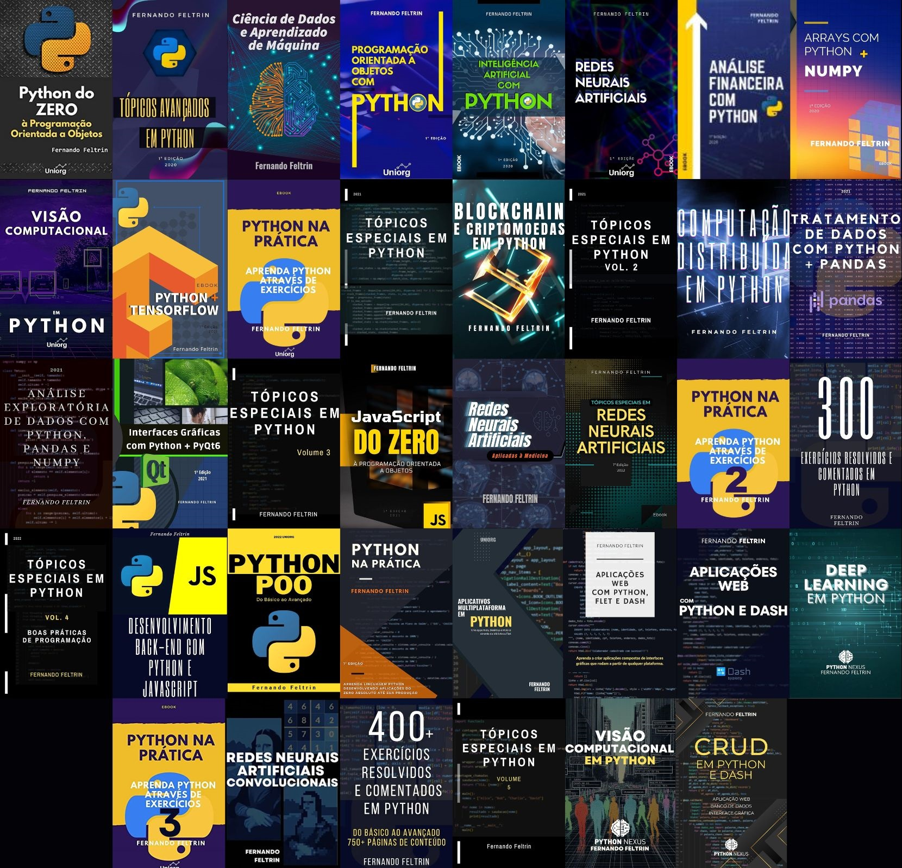
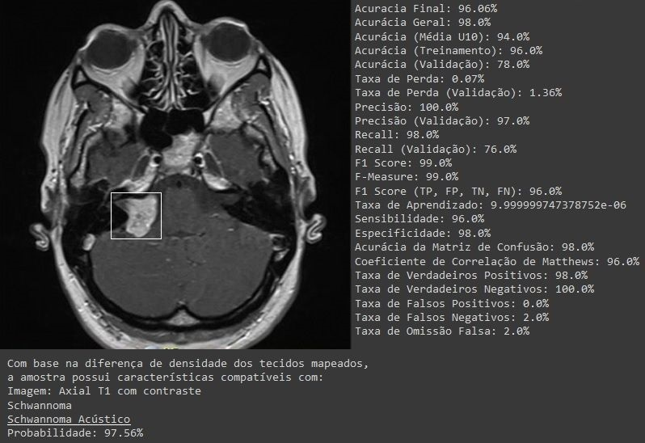

<h1 align="center">Olá Mundo!!! 👋 Prof. Eng. Fernando Feltrin aqui...</h1>
<h3 align="center">Engenheiro da Computação com especializações na área de neurociências e inteligência artificial, Professor licenciado para docência de nível técnico e superior, Autor de mais de 50 livros sobre programação de computadores e neurociências e responsável pelo desenvolvimento e implementação de ferramentas voltadas a visão computacional e modelos de redes neurais artificiais aplicadas à Radiologia (Diagnóstico por Imagem) / Neurologia.</h3>
<h3 align="left">Contato:</h3>
<h4 align="left">fernando2rad@gmail.com // (55) 99135-7259</h4>

<h3 align="left">Meus Livros:</h3>

  

 

<h3 align="center">--//--</h3>
<h3 align="center">NeuroCNN 3.0 - Detecção, Segmentação e Classificação de Massas Tumorais Cerebrais a Partir de Exames de Ressonância Magnética</h3>

 

 
